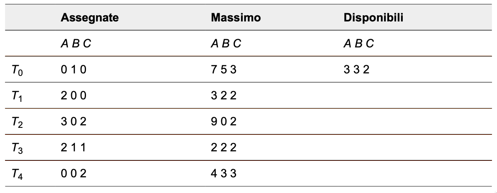
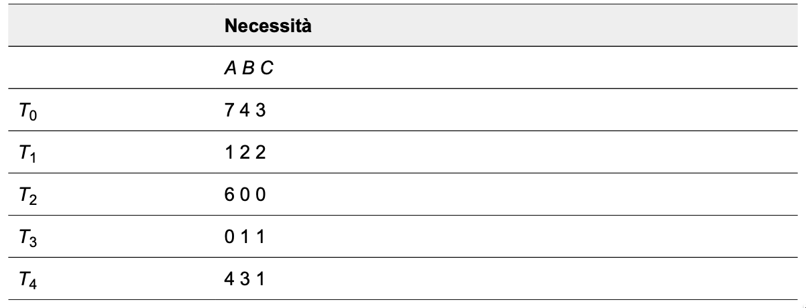
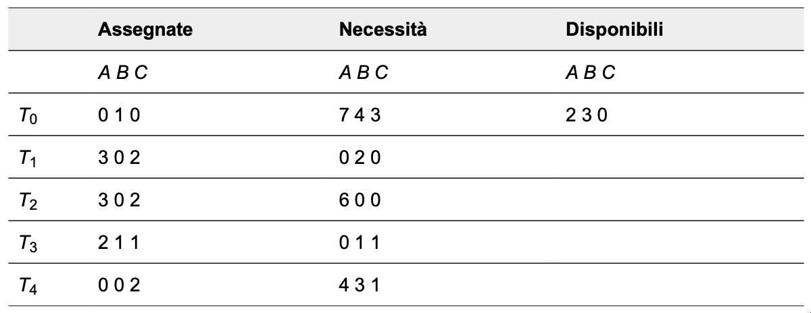

# Deadlock (Cap. 8)
Indice
1.  [Algoritmo del banchiere](#algoritmo-del-banchiere)
	- [Perchè questo nome?](#perchè-questo-nome)
	- [Realizzazione](#realizzazione)
	- [Algoritmo di verifica della sicurezza](#algoritmo-di-verifica-della-sicurezza)
	- [Algoritmo di richiesta delle risorse](#algoritmo-di-richiesta-delle-risorse)
	- [Esempio](#esempio)

## Algoritmo del banchiere
### Perchè questo nome?
Questo nome è stato scelto perché l’algoritmo si potrebbe impiegare in un sistema bancario per assicurare che la banca non assegni mai tutto il denaro disponibile, in modo da non poter più soddisfare le richieste di tutti i suoi clienti.  
  
Quando si presenta al sistema, un nuovo thread deve dichiarare il numero massimo delle istanze di ciascun tipo di risorsa di cui potrà aver bisogno.  
Questo numero non può superare il numero totale delle risorse del sistema.  
Quando un utente richiede un gruppo di risorse, si deve stabilire se l’assegnazione di queste risorse lasci il sistema in uno stato sicuro.  
Se si rispetta tale condizione, si assegnano le risorse, altrimenti il thread deve attendere che qualche altro thread ne rilasci un numero sufficiente.
  

[Torna all'indice](#deadlock-cap-8)
  
### Realizzazione
La realizzazione richiede la gestione di alcune strutture dati che codificano lo stato di assegnazione delle risorse del sistema.  

Sia `n` il numero di thread del sistema e `m` il numero dei tipi di risorsa. Sono necessarie le seguenti strutture dati.

- Disponibili: un vettore di lunghezza m che indica il numero delle istanze disponibili per ciascun tipo di risorsa;  
`disponibili[j] = k` significa che sono disponibili `k` istanze del tipo di risorsa `Rj`.

- Massimo: una matrice `n × m` che definisce la richiesta massima di ciascun thread;  
`massimo[i, j] = k` significa che il thread `Ti` può richiedere un massimo di `k` istanze del tipo di risorsa `Rj`.

- Assegnate: una matrice `n × m` che definisce il numero delle istanze di ciascun tipo di risorsa attualmente assegnate a ogni thread;  
`assegnate[i, j] = k` significa che al thread `Ti` sono correntemente assegnate `k` istanze del tipo di risorsa `Rj`.

- Necessità: una matrice `n × m` che indica la necessità residua di risorse relativa a ogni thread;  
`necessità[i, j] = k` significa che il thread `Ti`, per completare il suo compito, può avere bisogno di altre `k` istanze del tipo di risorsa `Rj`.  
  
Si osservi che `Necessità[i, j] = Massimo[i, j] – Assegnate[i, j]`.  
  
Col trascorrere del tempo, queste strutture dati variano sia nelle dimensioni sia nei valori.  
  

[Torna all'indice](#deadlock-cap-8)

### Algoritmo di verifica della sicurezza
L’algoritmo utilizzato per scoprire se il sistema è o non è in uno stato sicuro si può descrivere come segue.

1. Siano `Work` e `Finish` vettori di lunghezza `m` ed `n` rispettivamente; si inizializzi: 
	- `Work = Disponibili`
	- `Finish[i] = false` per i = 0, 1, ..., n.
2. Si cerchi `i` tale che valgano contemporaneamente:
	- `Finish[i] = false`
	- `Need(i) <= Work`
	Se tale i non esiste, si esegua il passo 4.
3. Si assegni `Work = Work + Assegnate_i`
	- `Finish[i]= true`
	- Si torni al passo 2.
4. Se `Finish[i]=true` per ogni `i` il sistema è in stato sicuro, altrimenti lo stato è non sicuro.
  
  
[Torna all'indice](#deadlock-cap-8)  

### Algoritmo di richiesta delle risorse
Sia `Richieste_i` il vettore delle richieste per il thread `Ti`.  
Se `Richieste_i[j] == k`, allora il thread `Ti` richiede `k` istanze del tipo di risorsa `Rj`.  
Se il thread `Ti` effettua una richiesta di risorse, si svolgono le seguenti azioni:

1. Se `Richieste_i ≤ Necessità_i`, si va al passo 2, altrimenti si riporta una condizione d’errore, poiché il thread ha superato il numero massimo di richieste.
2. Se `Richieste_i ≤ Disponibili`, si esegue il passo 3, altrimenti `Ti` deve attendere poiché le risorse non sono disponibili.
3. Si simula l’assegnazione al thread `Ti` delle risorse richieste modificando come segue lo stato di assegnazione delle risorse:
```
Disponibili = Disponibili – Richieste_i
Assegnate_i = Assegnate_i + Richieste_i
Necessità_i = Necessità_i – Richieste_i
```
  
Se lo stato di assegnazione delle risorse risultante è sicuro, la transazione è completata e al thread `Ti` si assegnano le risorse richieste.  
Tuttavia, se il nuovo stato è non sicuro, `Ti` deve attendere `Richieste_i` e si ripristina il vecchio stato di assegnazione delle risorse.  
  

[Torna all'indice](#deadlock-cap-8)  

### Esempio
Considerando un sistema con cinque thread, da `T0` a `T4`, e tre tipi di risorse: `A`, `B`, e `C`.  
Il tipo di risorse `A` ha 10 istanze, il tipo `B` ha 5 istanze e il tipo `C` ha 7 istanze.  
Si supponga che all’istante `T0` si sia verificata la seguente situazione del sistema:



Il contenuto della matrice Necessità è definito come Massimo – Assegnate:



Possiamo affermare che il sistema si trova attualmente in uno stato sicuro; infatti, la sequenza `< T1, T3, T4, T2, T0 >` soddisfa i criteri di sicurezza.  
Si supponga ora che il thread `T1` richieda un’altra istanza del tipo di risorsa `A` e due istanze del tipo `C`, quindi `Richieste1 = (1, 0, 2)`.  
Per stabilire se questa richiesta si possa soddisfare immediatamente verifichiamo la condizione `Richieste1 ≤ Disponibili` (vale a dire `(1, 0, 2) ≤ (3, 3, 2)`), che risulta vera.  
A questo punto simuliamo che questa richiesta sia stata soddisfatta, e otteniamo il seguente nuovo stato:



Occorre stabilire se questo nuovo stato del sistema sia sicuro; a tale scopo si esegue l’algoritmo di verifica della sicurezza da cui risulta che la sequenza `< T1, T3, T4, T0, T2 >` rispetta il requisito di sicurezza.  
Quindi si può soddisfare immediatamente la richiesta del thread `T1`.  

Tuttavia, dovrebbe essere chiaro che, quando il sistema si trova in questo stato, una richiesta di `(3, 3, 0)` da parte di `T4` non si può soddisfare perché non sono disponibili le risorse.  
Inoltre, una richiesta di `(0, 2, 0)` da parte di `T0` non si può soddisfare, anche se le risorse sono disponibili, poiché lo stato risultante sarebbe non sicuro.
  
  
[Torna all'indice](#deadlock-cap-8)  


