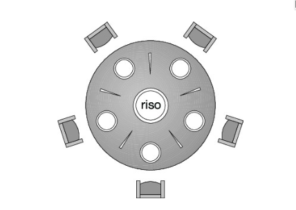
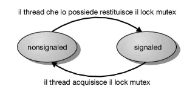

# Esempi di Sincronizzazione (Cap. 7)
Indice
1.  [Classici problemi di Sincronizzazione](#classici-problemi-di-sincronizzazione)
    - [Produttore-consumatore con memoria limitata](#produttore-consumatore-con-memoria-limitata)
    - [Problema dei lettori-scrittori](#problema-dei-lettori-scrittori)
    - [Problema dei cinque filosofi](#problema-dei-cinque-filosofi)
        - [Soluzione con uso dei semafori](#soluzione-con-uso-di-semafori)
        - [Soluzione con uso dei monitor](#soluzione-con-uso-dei-monitor)
2. [Sincronizzazione all'interno del Kernel](#sincronizzazione-allinterno-del-kernel)
    - [Windows](#sincronizzazione-in-windows)
    - [Linux](#sincronizzazione-dei-processi-in-linux)
3. [Sincronizzazione Posix](#sincronizzazione-posix)
    - [Lock mutex Posix](#lock-mutex-posix)
    - [Semafori Posix](#semafori-posix)
        - [Semafori Posix named](#semafori-posix-named)
        - [Semafori Posix unnamed](#semafori-posix-unnamed)
    - [Variabili condizionali Posix](#variabili-condizionali-posix)
    
#  Classici problemi di Sincronizzazione
Questi problemi sono utili per verificare quasi tutte le nuove proposte di schemi di sincronizzazione.

## Produttore-consumatore con memoria limitata
Nel nostro problema produttore e consumatore condividono le seguenti strutture dati:

```c++
int n;
semaphore mutex = 1; 
semaphore empty = n; 
semaphore full = 0;
```

Si supponga di disporre di una certa quantità di memoria rappresentata da un buffer con n posizioni, ciascuna capace di contenere un elemento.  
Il semaforo `mutex` garantisce la mutua esclusione degli accessi al buffer ed è inizializzato al valore 1.  
I semafori `full` ed `empty` conteggiano rispettivamente il numero di posizioni vuote e il numero di posizioni piene nel buffer.  
Il semaforo `empty` si inizializza al valore `n`; il semaforo `full` si inizializza al valore 0.  

```c++
// Produttore
while (true) {
  ...
  // produci un elemento in next_produced 
  ...
  wait(empty);
  wait(mutex);
  ...
  // inserisci next_produced in buffer
  ...
  signal(mutex);
  signal(full);
}
```

```c++
// Consumatore
while (true) { 
  wait(full); 
  wait(mutex); 
  ...
  // rimuovi un elemento da buffer e mettilo in next_consumed 
  ...
  signal(mutex);
  signal(empty);
  ...
  // consuma l’elemento contenuto in next_consumed  
  ...
}
```

È interessante notare la simmetria esistente tra il produttore e il consumatore.   
Il codice si può interpretare nel senso di produzione, da parte del produttore, di posizioni piene per il consumatore; oppure di produzione, 
da parte del consumatore, di posizioni vuote per il produttore.  
  
[Torna all'indice](#esempi-di-sincronizzazione-cap-7)

## Problema dei lettori-scrittori
Si supponga che una base di dati sia da condividere tra numerosi processi concorrenti.  
Alcuni processi possono richiedere solo la lettura del contenuto della base dati (lettori), mentre altri ne possono richiedere un aggiornamento, vale a dire una lettura e una scrittura (scrittori).  
Se due lettori accedono nello stesso momento all’insieme di dati condiviso, non si ha alcun effetto negativo.  
Se uno scrittore e un altro processo (lettore o scrittore) accedono contemporaneamente alla stessa base di dati, ne può derivare il caos.  
Per impedire l’insorgere di difficoltà di questo tipo è necessario che gli scrittori abbiano un accesso esclusivo in fase di scrittura alla base di dati condivisa.  
Il problema dei lettori-scrittori ha diverse varianti, che implicano tutte l’esistenza di priorità.  
La più semplice richiede che nessun lettore attenda, a meno che uno scrittore abbia già ottenuto il permesso di usare l’insieme di dati condiviso.   
In altre parole, nessun lettore deve attendere che altri lettori terminino l’operazione solo perché uno scrittore attende l’accesso ai dati.  
Il secondo problema richiede che uno scrittore, una volta pronto, esegua il proprio compito di scrittura al più presto.  In altre parole, se uno scrittore attende l’accesso all’insieme di dati, nessun nuovo lettore deve iniziare la lettura.  
La soluzione del primo problema e quella del secondo possono condurre a uno stato d’attesa indefinita (starvation), degli scrittori, nel primo caso; dei lettori, nel secondo.

La soluzione del primo problema dei lettori - scrittori prevede dunque la condivisione da parte dei processi lettori delle seguenti strutture dati:

```c++
semaphore rw_mutex = 1; 
semaphore mutex = 1; 
int read_count = 0;
```

I semafori binari `mutex` e `rw_mutex` sono inizializzati a 1; `read_count` è inizializzato a 0.  
Il semaforo `rw_mutex` è comune a entrambi i tipi di processi (lettori e scrittori).  
Il semaforo `mutex` si usa per assicurare la mutua esclusione al momento dell’aggiornamento di `read_count`.  
La variabile `read_count` contiene il numero dei processi che stanno attualmente leggendo l’insieme di dati.  
Il semaforo `rw_mutex` funziona come semaforo di mutua esclusione per gli scrittori e serve anche al primo o all’ultimo lettore che entra o esce dalla sezione critica.  
Non serve, invece, ai lettori che entrano o escono mentre altri lettori si trovano nelle rispettive sezioni critiche.  

```c++
// Scrittore
while (true) {
    wait(rw_mutex);
    ...
    // esegui l’operazione di scrittura
    ...
    signal(rw_mutex); 
}
```

```c++
// Lettore
while (true) { 
    wait(mutex); 
    read_count++;
    if (read_count == 1) 
        wait(rw_mutex); 
    signal(mutex); 
    ...
    // esegui l’operazione di lettura  
    ...
    wait(mutex);
    read_count--;
    if (read_count == 0)   
        signal(rw_mutex); 
    signal(mutex);
}
```

Occorre notare che se uno scrittore si trova nella sezione critica e `n` lettori attendono di entrarvi, si accoda un lettore a `rw_mutex` e `n` – 1 lettori a `mutex`.  
Inoltre, se uno scrittore esegue `signal(rw_mutex)` si può riprendere l’esecuzione dei lettori in attesa, oppure di un singolo scrittore in attesa.  
La scelta è fatta dallo scheduler.

Le soluzioni al problema dei lettori-scrittori sono state generalizzate su alcuni sistemi in modo da fornire lock di lettura-scrittura.  
Per acquisire un tale lock è necessario specificarne la modalità, scrittura o lettura: se il processo desidera solo leggere i dati condivisi, richiede un lock di lettura-scrittura in modalità lettura; se invece desidera anche modificare i dati, lo richiede in modalità scrittura.  
È permesso a più processi di acquisire lock di lettura-scrittura in modalità lettura, ma solo un processo alla volta può avere il lock di lettura-scrittura in modalità scrittura, visto che nel caso della scrittura è necessario garantire l’accesso esclusivo.

I lock di lettura - scrittura sono utili soprattutto nelle situazioni seguenti:
- Nelle applicazioni in cui è facile identificare i processi che si limitano alla lettura di dati condivisi e quelli che si limitano alla scrittura di dati condivisi.
- Nelle applicazioni che prevedono più lettori che scrittori. Infatti, i lock di lettura- scrittura comportano in genere un carico di lavoro aggiuntivo rispetto ai semafori o ai lock mutex, compensato però dalla possibilità di eseguire molti lettori in concorrenza.  
  
[Torna all'indice](#esempi-di-sincronizzazione-cap-7)


## Problema dei cinque filosofi
Si considerino cinque filosofi che trascorrono la loro esistenza pensando e mangiando.  
I filosofi condividono un tavolo rotondo circondato da cinque sedie, una per ciascun filosofo.  
Al centro del tavolo si trova una zuppiera colma di riso, e la tavola è apparecchiata con cinque bacchette.



Quando un filosofo pensa, non interagisce con i colleghi.  
Quando gli viene fame, tenta di prendere le bacchette più vicine: quelle che si trovano tra lui e i commensali alla sua destra e alla sua sinistra.  
Un filosofo può prendere una bacchetta alla volta e non può prendere una bacchetta che si trova già nelle mani di un suo vicino.  
Quando un filosofo affamato tiene in mano due bacchette contemporaneamente, mangia senza lasciare le bacchette.  
Terminato il pasto, le posa e riprende a pensare.

Il problema dei cinque filosofi è considerato un classico problema di sincronizzazione, non certo per la sua importanza pratica, e neanche per antipatia verso i filosofi da parte degli informatici, ma perché rappresenta una vasta classe di problemi di controllo della concorrenza, in particolare i problemi caratterizzati dalla necessità di assegnare varie risorse a diversi processi evitando situazioni di stallo e d’attesa indefinita.  
  
[Torna all'indice](#esempi-di-sincronizzazione-cap-7)

### Soluzione con uso di semafori
Una semplice soluzione consiste nel rappresentare ogni bacchetta con un semaforo: un filosofo tenta di afferrare ciascuna bacchetta eseguendo un’operazione `wait()` su quel semaforo e la posa eseguendo operazioni `signal()` sui semafori appropriati.  
Quindi, i dati condivisi sono
```c++
semaphore chopstick[5];
```
dove tutti gli elementi chopstick sono inizializzati a 1.

```c++
// Struttura del filosofo i
while (true) { 
    wait(chopstick[i]); 
    wait(chopstick[(i + 1) % 5]); 
    ...
    /* mangia */
    ...
    signal(chopstick[i]); 
    signal(chopstick[(i + 1) % 5]); 
    ...
    /* pensa */ 
    ...
}
```

Questa soluzione garantisce che due vicini non mangino contemporaneamente, ma è insufficiente poiché non esclude la possibilità che si abbia una situazione di stallo.  
Si supponga che tutti e cinque i filosofi abbiano fame contemporaneamente e che ciascuno afferri la bacchetta di sinistra.  
Tutti gli elementi di chopstick diventano uguali a zero, perciò ogni filosofo che tenta di afferrare la bacchetta di destra entra in stallo.  
Tali situazioni di stallo possono essere evitate con i seguenti espedienti:
- Solo quattro filosofi possono stare contemporaneamente a tavola;
- Un filosofo può prendere le sue bacchette solo se sono entrambe disponibili (quest’operazione si deve eseguire in una sezione critica);
- Si adotta una soluzione asimmetrica: un filosofo dispari prende prima la bacchetta di sinistra e poi quella di destra, invece un filosofo pari prende prima la bacchetta di destra e poi quella di sinistra.

Si noti tuttavia che qualsiasi soluzione soddisfacente per il problema dei cinque filosofi deve escludere la possibilità di situazioni d’attesa indefinita, in altre parole che uno dei filosofi muoia di fame (da qui il termine starvation) – una soluzione immune alle situazioni di stallo non esclude necessariamente la possibilità di situazioni d’attesa indefinita.  
  
[Torna all'indice](#esempi-di-sincronizzazione-cap-7)

### Soluzione con uso dei monitor
La soluzione impone il vincolo che un filosofo possa prendere le sue bacchette solo quando siano entrambe disponibili.  
Per codificare questa soluzione si devono distinguere i tre diversi stati in cui può trovarsi un filosofo.  
A tale scopo si introduce la seguente struttura dati:

```c++
enum {THINKING, HUNGRY, EATING} state[5];
```

Il filosofo `i` può impostare la variabile `state[i] = EATING` solo se i suoi due vicini non stanno mangiando:  

```c++
if((state[(i + 4) % 5] != EATING) && (state[(i + 1) % 5] != EATING))
    state[i] = EATING
```

Inoltre, occorre dichiarare la seguente struttura dati:

```c++
condition self[5];
```

che permette al filosofo i di ritardare se stesso quando ha fame, ma non riesce a ottenere le bacchette di cui ha bisogno.  

```c++
monitor DiningPhilosophers {
    enum {THINKING, HUNGRY, EATING} state[5]; 
    condition self[5];
    
    void pickup(int i) {
        state[i] = HUNGRY; 
        test(i);
        if (state[i] != EATING)
            self[i].wait();
    }
    
    void putdown(int i) {
        state[i] = THINKING; 
        test((i + 4) % 5); 
        test((i + 1) % 5);
    }
    
    void test(int i) {
        if ((state[(i + 4) % 5] != EATING) && (state[i] == HUNGRY) && (state[(i + 1) % 5] != EATING)) {
            state[i] = EATING; 
            self[i].signal();
        } 
    }
    
    Initialization_code() {
        for (int i = 0; i < 5; i++)
            state[i] = THINKING;
    } 
}
```

A questo punto si può descrivere la soluzione al problema dei cinque filosofi. La distribuzione delle bacchette è controllata dal monitor `DiningPhilosophers`.  
Ciascun filosofo, prima di cominciare a mangiare, deve invocare l’operazione `pickup()`; ciò può determinare la sospensione del processo filosofo.  
Completata con successo l’operazione, il filosofo può mangiare; in seguito, il filosofo invoca l’operazione `putdown()` e comincia a pensare.  

```c++
DiningPhilosophers.pickup(i); 
...
eat
... 
DiningPhilosophers.putdown(i);
```

È facile dimostrare che questa soluzione assicura che due vicini non mangino contemporaneamente e che non si verifichino situazioni di stallo.  
Occorre però notare che un filosofo può attendere indefinitamente.  
La soluzione di questo problema è lasciata come esercizio per il lettore.  
  
[Torna all'indice](#esempi-di-sincronizzazione-cap-7)


# Sincronizzazione all'interno del Kernel
Questi due sistemi (Windows e Linux) offrono buoni esempi di approcci differenti rispetto alla sincronizzazione del kernel.

## Sincronizzazione in Windows
Il sistema operativo Windows ha un kernel multithread che offre anche il supporto alle applicazioni in tempo reale e alle architetture multiprocessore.  
Quando il kernel di Windows accede a una risorsa globale in un sistema con monoprocessore, disabilita temporaneamente le interruzioni con interrupt handler che potrebbero accedere alla stessa risorsa globale.  
In un sistema multiprocessore, Windows protegge l’accesso alle risorse globali con i semafori ad attesa attiva (spinlock), anche se il kernel usa i semafori ad attesa attiva solo per proteggere segmenti di codice brevi.  
Inoltre il kernel impedisce che un thread sia sottoposto a prelazione mentre detiene uno spinlock.  
  
Per la sincronizzazione fuori dal kernel, Windows offre gli oggetti `dispatcher`, che permettono ai thread di sincronizzarsi servendosi di diversi meccanismi, inclusi lock mutex, semafori, eventi e timer.  
I dati condivisi vengono protetti richiedendo che un thread entri in possesso di un mutex prima di potervi accedere, e rilasci il mutex al completamento dell’elaborazione di quei dati.
  
Gli eventi possono notificare il verificarsi di una determinata condizione a un thread che l’attendeva.  
Infine i timer sono usati per informare un thread (o più di uno) della scadenza di uno specifico periodo di tempo.  
Gli oggetti dispatcher possono essere nello stato signaled o nello stato nonsignaled.  
Uno stato `signaled` indica che l’oggetto è disponibile e che un thread che tentasse di accedere all’oggetto non sarebbe bloccato.  
Uno stato `nonsignaled` indica che l’oggetto non è disponibile e che qualsiasi thread che tentasse di accedervi sarebbe bloccato.

  
  
[Torna all'indice](#esempi-di-sincronizzazione-cap-7)

## Sincronizzazione dei processi in Linux
Prima della versione 2.6, Linux adoperava un kernel senza prelazione; ciò significa che un processo in esecuzione in modalità kernel non poteva essere prelazionato – neppure nel caso in cui processi con priorità più alta fossero pronti per l’esecuzione.  
Ora il kernel di Linux ha adottato compiutamente il procedimento della prelazione, cosicché i task attivi nel kernel possono essere sottoposti a prelazione.  
Linux fornisce diversi meccanismi per la sincronizzazione nel kernel.  
Dato che la maggior parte delle architetture fornisce istruzioni per le versioni atomiche di semplici operazioni matematiche, la tecnica di sincronizzazione più semplice nel kernel di Linux è l’intero atomico, rappresentato mediante il tipo di dato opaco `atomic_t`.  
Tutte le operazioni matematiche che usano numeri interi atomici vengono eseguite senza interruzioni.  

Si prenda in considerazione un programma composto da un intero atomico `counter` e da un intero `value`:

```c++
atomic_t counter; 
int value;
```

Il seguente codice illustra l’effetto dell’esecuzione di alcune operazioni atomiche:
```c++
atomic_set(&counter,5); /* counter = 5 */ 
atomic_add(10,&counter);/* counter = counter + 10 */ 
atomic_sub(4,&counter);/* counter = counter - 4 */ 
atomic_inc(&counter);/* counter = counter + 1 */ 
value = atomic_read(&counter);/* value = 12 */
```

Gli interi atomici sono particolarmente efficienti in situazioni in cui deve essere aggiornata una variabile intera, per esempio un contatore, in quanto non risentono dell’overhead dei meccanismi di lock.  
Il loro utilizzo è tuttavia limitato a questi tipi di scenario. In situazioni in cui vi sono diverse variabili che contribuiscono a una possibile race condition, devono essere utilizzati strumenti di lock più sofisticati.  

In Linux sono disponibili i lock mutex, utili per proteggere le sezioni critiche all’interno del kernel. In caso di loro utilizzo, un task deve invocare la funzione `mutex_lock()` prima di entrare in una sezione critica e la funzione `mutex_unlock()` dopo l’uscita dalla sezione critica.  
Se il lock mutex non è disponibile, il task che ha invocato la `mutex_lock()` viene sospeso; verrà risvegliato quando il proprietario del lock invoca `mutex_unlock()`.  
  
[Torna all'indice](#esempi-di-sincronizzazione-cap-7)


# Sincronizzazione Posix
I metodi di sincronizzazione discussi precedentemente riguardano la sincronizzazione all’interno del kernel e sono quindi disponibili solo agli sviluppatori del kernel.  
L’API Posix è invece a disposizione dei programmatori a livello utente e non fa parte di alcun particolare kernel.

## Lock mutex Posix
I lock mutex rappresentano la tecnica di sincronizzazione fondamentale in ambiente Pthreads.  
La loro finalità è di proteggere le sezioni critiche del codice: un thread acquisisce un lock prima di entrare in una sezione critica.  
Quindi, al momento di uscirne, lo rilascia.  
Pthreads utilizza il tipo di dato `pthread_mutex_t` per i lock mutex.  
Un mutex viene creato mediante la funzione `mutex_pthread_init()`.  
Il primo parametro è un puntatore al mutex.  
Passando NULL come secondo parametro si inizializza il mutex agli attributi predefiniti.

```c++
#include <pthread.h>
pthread_mutex_t mutex;
/* crea e inizializza il lock mutex */ 
pthread_mutex_init(&mutex, NULL);
```

Il mutex viene acquisito e rilasciato con le funzioni `pthread_mutex_lock()` e `pthread_mutex_unlock()`.  
Se il lock mutex non è disponibile quando viene invocata la `pthread_mutex_lock()`, il thread chiamante viene bloccato finché il proprietario richiama `pthread_mutex_unlock()`.

```c++
 pthread_mutex_lock(&mutex); /* acquisisci il lock mutex */
/* sezione critica */
pthread_mutex_unlock(&mutex); /* rilascia il lock mutex */ 
```
Questo codice mostra come proteggere una sezione critica con i lock mutex.  
  
[Torna all'indice](#esempi-di-sincronizzazione-cap-7)

## Semafori Posix
Posix definisce due tipi di semafori: con nome (named) e senza nome (unnamed).  
Le due tipologie sono abbastanza simili, ma differiscono nel metodo di creazione e condivisione tra processi dei semafori. 

### Semafori Posix named
La funzione `sem_open()` viene utilizzata per creare e aprire un semaforo posix con nome:

```c++
#include <semaphore.h>
sem_t *sem;
/* Crea il semaforo e lo inizializza a 1 */ 
sem = sem_open(“SEM”, O_CREAT, 0666, 1);
```

In questo caso stiamo dando al semaforo il nome `SEM`.  
Il flag `O_CREAT` indica che il semaforo, se non esiste già, verrà creato.  
Inoltre, il semaforo fornisce accesso in lettura e scrittura agli altri processi (tramite il parametro 0666) ed è inizializzato a 1.  
Il vantaggio dei semafori con nome è che più processi non correlati possono facilmente utilizzare un semaforo comune come meccanismo di sincronizzazione, facendo semplicemente riferimento al nome del semaforo.  
  
Il seguente esempio di codice illustra la protezione di una sezione critica utilizzando il semaforo creato in precedenza:
```c++
/* acquisisce il semaforo */ 
sem_wait(sem); // ~ wait()
/* sezione critica */
/* rilascia il semaforo */ 
sem_post(sem); // ~ signal()
```  
  
[Torna all'indice](#esempi-di-sincronizzazione-cap-7)

### Semafori Posix unnamed
Un semaforo senza nome viene creato e inizializzato mediante la funzione `sem_init()`, a cui vengono passati tre parametri:
1. un puntatore al semaforo;
2. un flag che indica il livello di condivisione; 
3. il valore iniziale del semaforo.
L’uso di `sem_init()` è illustrato nel seguente codice:

```c++
#include <semaphore.h>
sem_t *sem;
/* Crea il semaforo e inizializzalo a 1 */ 
sem_init(sem, 0, 1);
```

In questo esempio il flag 0 indica che il semaforo può essere condiviso solo dai thread che appartengono al processo che lo ha creato. Il semaforo è inizializzato al valore 1.  

I semafori unnamed posix usano le stesse operazioni di quelli con nome, `sem_wait()` e `sem_post()`.  

```c++
/* acquisisci il semaforo */ 
sem_wait(sem);
/* sezione critica */
/* rilascia il semaforo */ 
sem_post(sem);
```
Il codice mostra come proteggere una sezione critica utilizzando il semaforo unnamed.  
  
[Torna all'indice](#esempi-di-sincronizzazione-cap-7)

## Variabili condizionali POSIX
Le variabili condizionali in Pthreads usano il tipo di dato `pthread_cond_t` e vengono inizializzate mediante la funzione `pthread_cond_init()`.  
Il codice seguente crea e inizializza una variabile condizionale e il lock mutex a essa associato:

```c++
pthread_mutex_t mutex; 
pthread_cond_t cond_var; 
pthread_mutex_init(&mutex, NULL); 
pthread_cond_init(&cond_var, NULL);
```

Per l’attesa su una variabile condizionale viene usata la funzione `pthread_cond_wait()`.  
Il seguente codice mostra come un thread può aspettare il verificarsi della condizione `a == b` utilizzando una variabile condizionale Pthreads:

```c++
pthread_mutex_lock(&mutex);
while (a != b)
pthread_cond_wait (&cond_var, &mutex); 
pthread_mutex_unlock(&mutex);
```

Il lock mutex associato alla variabile condizionale deve essere bloccato prima della chiamata `pthread_cond_wait()`, in quanto viene utilizzato per proteggere i dati nell’istruzione condizionale da una possibile race condition.  
Una volta acquisito il lock, il thread può verificare la condizione.  
Se la condizione non è verificata, il thread richiama `pthread_cond_wait()`, passando il lock mutex e la variabile condizionale come parametri.  
La chiamata a `pthread_cond_wait()` rilascia il lock mutex, consentendo in tal modo a un altro thread di accedere al dato condiviso ed eventualmente aggiornare il suo valore in modo che la condizione restituisca true.  
  
Un thread che modifica i dati condivisi può richiamare la funzione `pthread_cond_signal()`, in modo da mandare un segnale a un thread in attesa sulla variabile condizionale, come mostrato di seguito:

```c++
pthread_mutex_lock(&mutex)
a = b; 
pthread_cond_signal(&cond_var); 
pthread_mutex_unlock(&mutex);
```

È importante notare che il lock mutex non viene rilasciato dalla chiamata `pthread_cond_signal()`, ma dalla successiva chiamata `pthread_mutex_unlock()`.  
Una volta che il lock mutex viene rilasciato, il thread che ha ricevuto il segnale diventa proprietario del lock e il controllo riprende dalla chiamata alla `pthread_cond_wait()`.  
  
[Torna all'indice](#esempi-di-sincronizzazione-cap-7)
